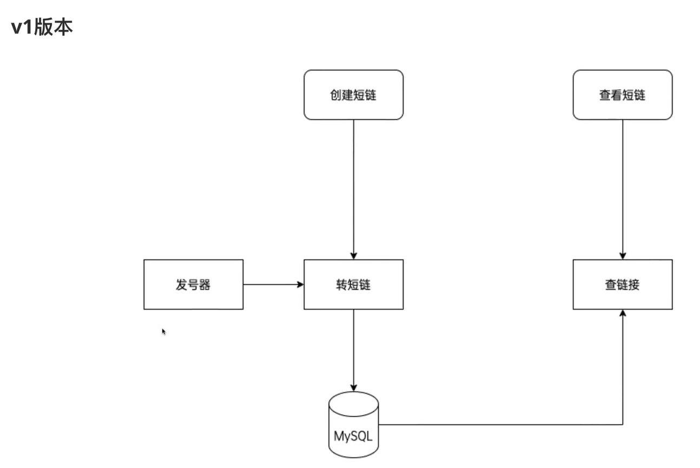
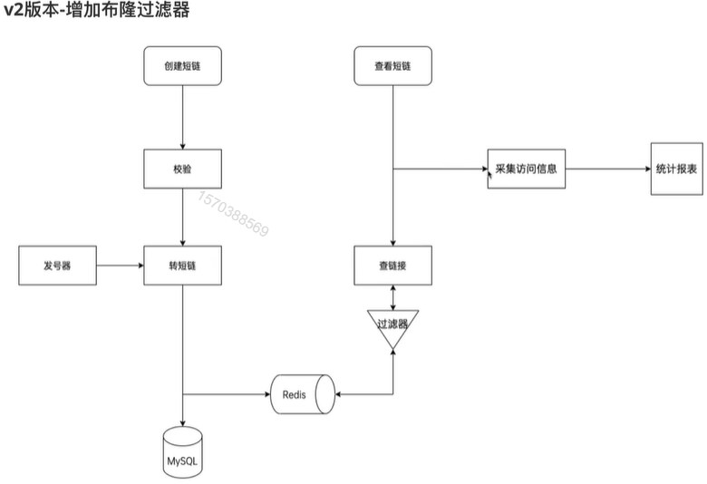

# 项目架构图



## 搭建项目骨架

1. 建库建表

   1.1 新建发号器表

   1.2 新建长短链接映射表

2. 搭建go-Zero框架的骨架

   2.1 编写api文件

   2.2 根据api文件生成go代码

3. 根据数据表生成model层代码

   ```bash
   goctl model mysql datasource -url="user:password@tcp(addr:port)/database" -table="table" -dir="./model"
   ```

4. 同步依赖

5. 配置文件，修改配置结构体和配置文件

## 开发

#### 1. 参数校验

1. 下载validator库

   ```bash
   go get github.com/go-playground/validator/v10
   ```

2. 导入validator库

   ```go
   import "github.com/go-playground/validator/v10"
   ```

   

3. 在api文件中为结构体添加validate tag，并添加校验规则

   

#### 2. 取号器

使用mysql的replace命令生成取号器

单独建表，一直执行replace into，执行后获取最后一次插入的id即得到号码num

#### 3. 生成短链

使用取号器生成的num，转换为base62进制，即得到短链接，拼接上域名返回

#### 4. 查看短链

#####   带缓存版本

1. 两种实现方式
 *  自己编写缓存代码，只存surl 和 lurl的映射关系      优势：能够节省缓存空间，缓存数据量小
 *  使用gozero自带的缓存，会把整条数据存入缓存     优势：不需要自己实现，开发量小

##### 	缓存引发的问题

  1.   缓存怎么设置？

       1. Redis集群部署

       2. 根据数据量设置内存大小，内存淘汰策略LRU，移除最近最少使用的key

  2.   如何解决缓存击穿的问题？

       1. 设置热点数据永不过期
       2. 添加锁
       3. 使用singleflight合并请求

  3.   如何解决缓存穿透问题？

       1. 布隆过滤器
       
          - 布隆过滤器优点    
       
            节省空间，并不存储原始数据，只用来判断某个元素是否存在
       
          - 原理
       
            - 介绍：[布隆过滤器(Bloom Filter)的原理和实现 - cpselvis - 博客园 (cnblogs.com)](https://www.cnblogs.com/cpselvis/p/6265825.html)
            - 在线可视化：[Bloom Filters (jasondavies.com)](https://www.jasondavies.com/bloomfilter/)
       
          - 实现
       
            - Go库：github.com/bits-and-blooms/bloom/v3
            - go-zero bloom：
       
          - 布隆过滤器变种
       
            1. 计数版布隆过滤器
            2.  ....
       
          - 应用
       
            - 防止内存穿透
            - 推荐系统去重
            - 黑白名单
            - 垃圾邮件过滤
       
       2. 布谷鸟过滤器

```tiki wiki
ps:

​	缓存穿透：

​	缓存穿透是指缓存和数据库中都没有的数据，而用户不断发起请求。由于缓存是不命中时被动写的，并且出于容错考虑，如果从存储层查不到数据则不写入缓存，这将导致这个不存在的数据每次请求都要到存储层去查询，失去了缓存的意义。

​	缓存击穿：

​	缓存击穿是指缓存中没有但数据库中有的数据（一般是缓存时间到期），这时由于并发用户特别多，同时读缓存没读到数据，又同时去数据库去取数据，引起数据库压力瞬间增大，造成过大压力。

​	缓存雪崩：

​	缓存雪崩是指缓存中数据大批量到过期时间，而查询数据量巨大，引起数据库压力过大甚至down机。和缓存击穿不同的是，缓存击穿指并发查同一条数据，缓存雪崩是不同数据都过期了，很多数据都查不到从而查数据库。
```





## 简历

- 参考链接

​	[如何打造一份优雅的简历？ - Stefno - 博客园 (cnblogs.com)](https://www.cnblogs.com/qcrao-2018/p/11150411.html)

#### 1. 拓展问题

	1. 常见的http状态码： [HTTP 响应状态码 - HTTP | MDN (mozilla.org)](https://developer.mozilla.org/zh-CN/docs/Web/HTTP/Status)
	1. 分别介绍303和307：[http 状态码301、302、303、307、308 的区别 - 简书 (jianshu.com)](https://www.jianshu.com/p/70062192f26b)
