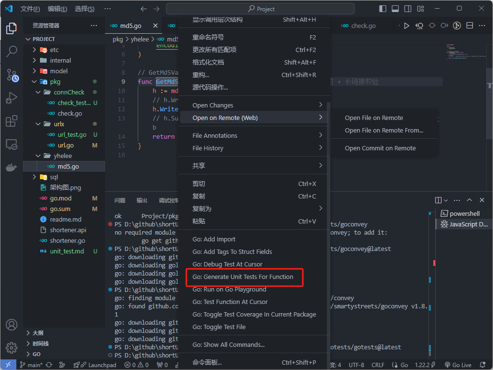
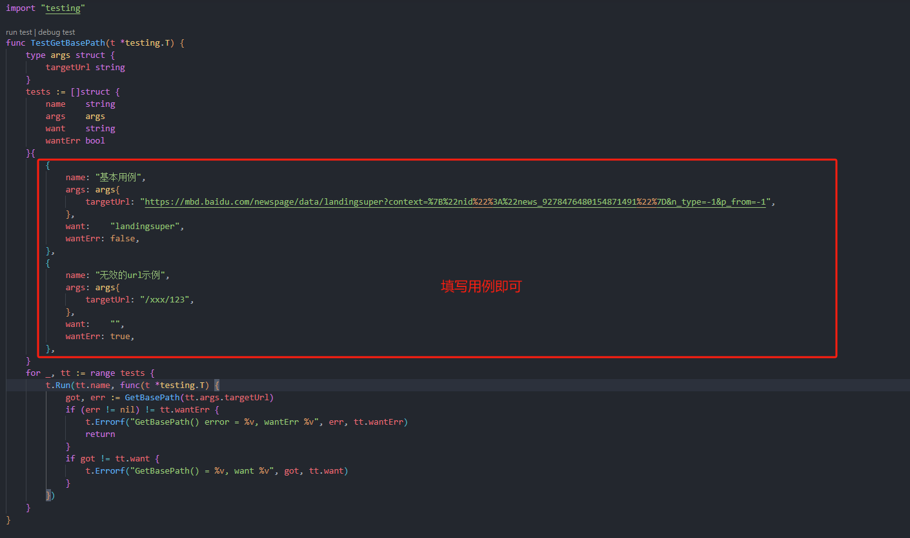
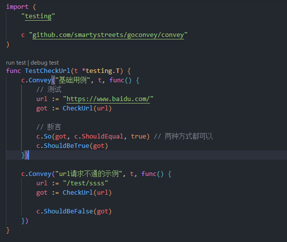

## 两个单测工具

### gotests

```bash
go install -v github.com/cweill/gotests/gotests@latest
```

* 安装gotests后，在vscode中选中函数，右键即可生成对应函数的单元测试



* 语法简单，填写用例即可




### Convey

```bash
go install github.com/smartystreets/goconvey@latest
```

* 导入convey包编写单元测试，优点：多用例时结构清晰

  


## 启动单测方式

1. 点击单测函数左上角run test

2. 使用go test 命令

   ```bash
   go test -run ^TestCheckUrl$ Project/pkg/connCheck -v
   ```

   * ^TestCheckUrl 单元测试函数名称
   * $ Project/pkg/connCheck 单测文件位置
   * -v 显示单测详细信息

